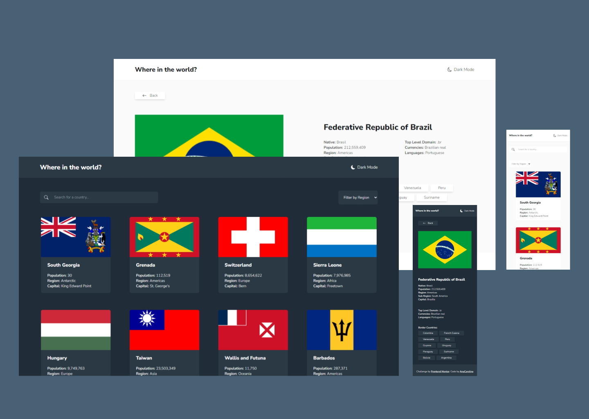

# Frontend Mentor - REST Countries API with color theme switcher solution

This is a solution to the [REST Countries API with color theme switcher challenge on Frontend Mentor](https://www.frontendmentor.io/challenges/rest-countries-api-with-color-theme-switcher-5cacc469fec04111f7b848ca). Frontend Mentor challenges help you improve your coding skills by building realistic projects.

## Table of contents

- [Overview](#overview)
  - [The challenge](#the-challenge)
  - [Screenshot](#screenshot)
  - [Links](#links)
- [My process](#my-process)
  - [Built with](#built-with)
  - [What I learned](#what-i-learned)
  - [Continued development](#continued-development)
  - [Useful resources](#useful-resources)
- [Author](#author)

## Overview

### The challenge

Users should be able to:

- See all countries from the [REST COUNTRIES API](https://restcountries.com/) on the homepage
- Search for a country using an `input` field
- Filter countries by region
- Click on a country to see more detailed information on a separate page
- Click through to the border countries on the detail page
- Toggle the color scheme between light and dark mode _(optional)_

### Screenshot

### Links

- Live Site URL: 

## My process

### Built with

- Semantic HTML5 markup
- CSS custom properties
- Flexbox
- CSS Grid
- Mobile-first workflow
- [Vite](https://vite.dev/) - Front-end build tool
- [React](https://reactjs.org/) - JS library
- [React Router](https://reactrouter.com/en/main) - Client side routing
- [TanStack Query (FKA React Query)](https://tanstack.com/query/latest/docs/framework/react/overview) - JS library for data management
- [Tailwind](https://tailwindcss.com/) - CSS Framework

### What I learned

During the development of this project, I gained valuable experience in both UI design and implementing advanced functionalities:

- **Light/dark theme with Tailwind:** Learned to implement a responsive light/dark mode using Tailwind's `dark` variant. I also created a custom hook to toggle themes and persist the user's preference in local storage.
- **Routing & Loader Functions:** Explored React Router, following their official tutorial and documentation to implement client-side routing and utilized loader functions to fetch and prepare data for the details country page;
- **URL Params:** learned how to work with URL parameters to save the page data state, like the region filter;
- **Combobox pattern:** Implemented combobox pattern for an accessible search bar, where the user can navigate it using the keyboard keys and have proper audio description.
- **React ref and React Key events:** These concepts were used to implement the keyboard interactions for the search bar.
- **Debounce:** utilized the debounce technique to optimize the search input since it reduces the amount of fetch requests;
- **Infinite scroll:** Implemented it on the main page to reduce the amount of components, especially image elements, improving performance.
- **React Query:** Gained experience using React Query for efficient data fetching and caching, improving the application's performance and state management.

These learnings enriched my skills in creating modern, user-friendly web applications while learning more about performance, accessibility, and state management.

### Continued development

This project still has room for improvement, especially in performance. I intend to learn how to preload images in React to reduce the First Contentful Paint and dive deeper into the Combobox pattern to improve accessibility and fix some issues present in the one implemented in this project.

For the following projects, I'll focus on learning more about performance, core vitals, testing, and NextJs.

### Useful resources

- [Building a theme switch component](https://web.dev/articles/building/a-theme-switch-component)
- [Why You Need React Query](https://tkdodo.eu/blog/why-you-want-react-query)
- [Consumo de APIs RESTful no React da maneira certa - Decode #009](https://www.youtube.com/live/uNFB9EbQz90?si=LA9G4gJjfT-XMuD1)
- [Easy and more consistent layouts using subgrid](https://youtu.be/IIQa9f0REtM?si=-25C1AZiXU72kMEZ)
- [You can't do this without subgrid](https://youtu.be/R7aHcgIeATE?si=e2lF6u2YB46KapuV)
- [React Query meets React Router](https://tkdodo.eu/blog/react-query-meets-react-router) -[Data Library Integration - React Router](https://reactrouter.com/en/main/guides/data-libs)
- [Como gerenciar estados de paginação usando o useQuery](https://youtu.be/7zb1-pR3Jxk?si=GpE4dltcni9ct0XO)
- [Você não deveria usar estados do React pra TUDO! (URL State)](https://youtu.be/YJmcyvrJf20?si=dPMwjPA_TFr3Y9a5)
- [Accessible site search with combobox suggestions](https://www.makethingsaccessible.com/guides/accessible-site-search-with-combobox-suggestions/)
- [How to Create Infinite Scrolling in React Using the Intersection Observer API](https://www.freecodecamp.org/news/infinite-scrolling-in-react/)
- [useLocation - React Router Dom](https://reactrouter.com/en/main/hooks/use-location)
- [How to write the correct type for useLoaderData()? (Typescript)](https://github.com/remix-run/react-router/discussions/9792)
- [Accessible Loading Indicators—with No Extra Elements!](https://dockyard.com/blog/2020/03/02/accessible-loading-indicatorswith-no-extra-elements)
- [Learn Debounce And Throttle In 16 Minutes](https://youtu.be/cjIswDCKgu0?si=Ye8btAAKyH7ujhFU)
- [Combobox Pattern - ARIA](https://www.w3.org/WAI/ARIA/apg/patterns/combobox/)
- [React Custom Hooks: useDebounce](https://dev.to/codebayu/react-custom-hooks-usedebounce-4il9)

## Author

- Frontend Mentor - [AnaCarolina](https://www.frontendmentor.io/profile/AnaCarol2001)
